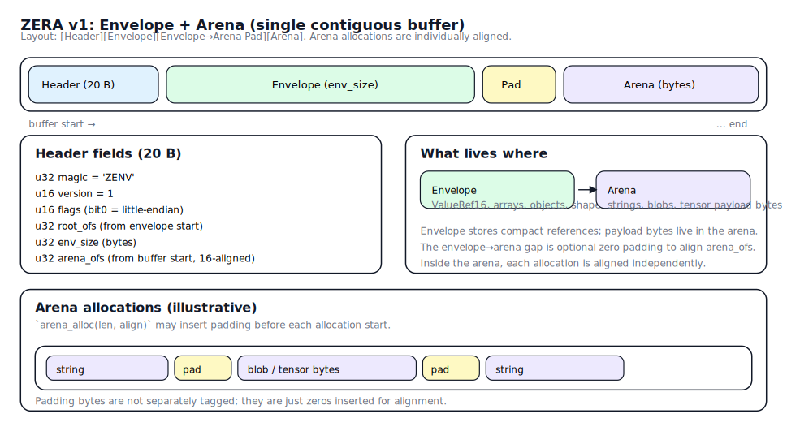

# ZERA (Zerialize Envelope + Arena) Protocol

`ZERA` is zerialize’s built-in, dependency-free binary protocol. It is designed for:

- A JSON-compatible dynamic data model (maps with string keys, arrays, primitive scalars, strings, blobs).
- Lazy / “touch only what you read” traversal.
- Zero-copy access to variable-sized payloads (strings, blobs) when the backing buffer is kept alive.
- A 16-byte–aligned arena so tensor payloads can be safely *viewed* as `T*` when alignment permits.
- A “checked reader” that validates offsets/lengths and rejects corrupt buffers.

Implementation: `include/zerialize/protocols/zera.hpp`  

## Data Model

ZERA’s model is the least-common-denominator across zerialize protocols:

- `null`
- `bool`
- `int64` (canonical signed integer)
- `uint64` (supported by the current implementation as an extension tag; see below)
- `float64` (canonical float)
- `string` (UTF-8 bytes, not null-terminated)
- `array` (ordered list of values)
- `object` (map from UTF-8 string keys → values)
- `blob` (bytes; represented as a typed array of `u8` with shape `[N]`)

### Notes on tensors

Zerialize’s tensor helpers (xtensor/Eigen) use the library’s generic “tensor triple” model:

`[dtype_code, shape, blob]`

ZERA stores the `blob` as a true byte payload in the arena (no base64).

## Buffer Layout (v1)

Each message is a single contiguous byte buffer:

`[Header][Envelope][Padding][Arena]`

The *Envelope* contains fixed-size value references and small structured payloads (arrays, objects, shapes).  
The *Arena* contains variable-sized payloads (strings, blobs/typed array data).

All multi-byte integers in ZERA are **little-endian**.

### Diagram

## Header (20 bytes)

Byte layout:

- `u32 magic` = `'ZENV'` (`0x564E455A`)
- `u16 version` = `1`
- `u16 flags` = bit0 must be `1` (little-endian), others must be `0`
- `u32 root_ofs` = offset (from envelope start) to the root `ValueRef16`
- `u32 env_size` = envelope length in bytes
- `u32 arena_ofs` = offset (from buffer start) to arena start

Invariants:

- `arena_ofs` must be aligned to `ARENA_BASE_ALIGN` (`16`).
- `arena_ofs >= header_size + env_size` (optional zero padding between envelope and arena).

## `ValueRef16` (16 bytes)

Every value in the envelope is represented by a fixed 16-byte reference:

- `u8  tag`
- `u8  flags` (bit0 = inline payload; used by `STRING` only)
- `u16 aux` (small per-tag data; e.g. bool value, dtype, inline length)
- `u32 a`
- `u32 b`
- `u32 c`

### Tags

The v1 spec defines:

- `0 NULL`
- `1 BOOL`
- `2 I64`
- `3 F64`
- `4 STRING`
- `5 ARRAY`
- `6 OBJECT`
- `7 TYPED_ARRAY`

The current implementation in `include/zerialize/protocols/zera.hpp` also supports:

- `8 U64` (to preserve full `uint64_t` values without truncation)

### Scalar encoding

- `BOOL`: `aux = 0 or 1`
- `I64`: 64-bit payload bits stored in `(a,b)` (`a=low32`, `b=high32`)
- `U64`: 64-bit payload bits stored in `(a,b)` (`a=low32`, `b=high32`)
- `F64`: IEEE754 bits stored in `(a,b)`; reader `memcpy`s bits into `double`

Scalars may not be naturally aligned in the envelope. Readers should use `memcpy` or recomposition rather than unaligned typed loads.

### Strings

Two encodings:

- **Inline strings**: `flags&1==1`, `aux = byte_len (0..12)`, bytes stored in the 12-byte region spanning fields `(a,b,c)` in increasing address order.
- **Arena-backed strings**: `flags==0`, `a = arena_ofs`, `b = byte_len`.

### Arrays

`ARRAY` values point to an `ArrayPayload` in the envelope:

- `u32 count`
- `ValueRef16 elems[count]` (contiguous)

### Objects

`OBJECT` values point to an `ObjectPayload` in the envelope:

- `u32 count`
- then `count` entries back-to-back:
  - `u16 key_len`
  - `u16 reserved` (0)
  - `u8  key_bytes[key_len]`
  - `ValueRef16 value`

Lookups are a linear scan over entries. This keeps the format small and simple in v1.

### Typed arrays and blobs

`TYPED_ARRAY` is used by ZERA primarily to store a binary payload in the arena plus a shape in the envelope:

- `aux = dtype` enum
- `a = arena_ofs` to raw data
- `b = byte_len`
- `c = envelope_ofs` to `ShapePayload`

`ShapePayload` is:

- `u32 rank` (v1 recommends `<= 8`)
- `u64 dims[rank]`

A “blob” is `TYPED_ARRAY` with dtype `u8` and rank 1, where `dims[0] == byte_len`.

## Arena and Alignment

The arena is a raw byte region containing no per-segment headers.

- The arena base (`arena_ofs`) is 16-byte aligned (`ARENA_BASE_ALIGN = 16`).
- The writer aligns each arena allocation so that the payload address meets the required alignment.

This is crucial for tensor views:

- The tensor libraries can only safely reinterpret raw bytes as `T*` if the address is aligned to `alignof(T)`.
- If it’s not aligned, zerialize will copy into an owning buffer.

To make this decision visible, zerialize provides `tensor::TensorViewInfo`:

- `include/zerialize/tensor/view_info.hpp`
- Exposed via `XTensorView::viewInfo()` and `EigenMatrixView::viewInfo()`.

## Why ZERA is “this way”

The core choices are about balancing simplicity, safety, and performance:

- **Fixed `ValueRef16`** enables O(1) skipping and compact array storage.
- **One contiguous buffer** is cache-friendly and easy to transmit/store.
- **Envelope + arena** keeps the envelope dense while allowing aligned payloads.
- **u32 offsets/lengths** keep references compact and fast; v1 messages are < 4 GiB.
- **Linear-scan objects** keep v1 implementation simple and predictable; indexing can be added later if needed.
- **Checked reader** makes it reasonable to use ZERA on untrusted input.

## Interop and Translation

ZERA implements the same zerialize `Reader`/`Writer` surface as the other protocols, so you can:

- Serialize with `serialize<zerialize::Zera>(...)`
- Translate to/from other protocols with `translate<OtherProto>(zer_reader)` / `translate<zerialize::Zera>(other_reader)`

## Limitations and Future Work

- `OBJECT` lookup is linear-time (v1 by design).
- The v1 spec includes general typed arrays, but current library usage focuses on `u8` blobs for tensor payload bytes.
- In-place mutation is intentionally constrained (no growth/relocation in v1).
